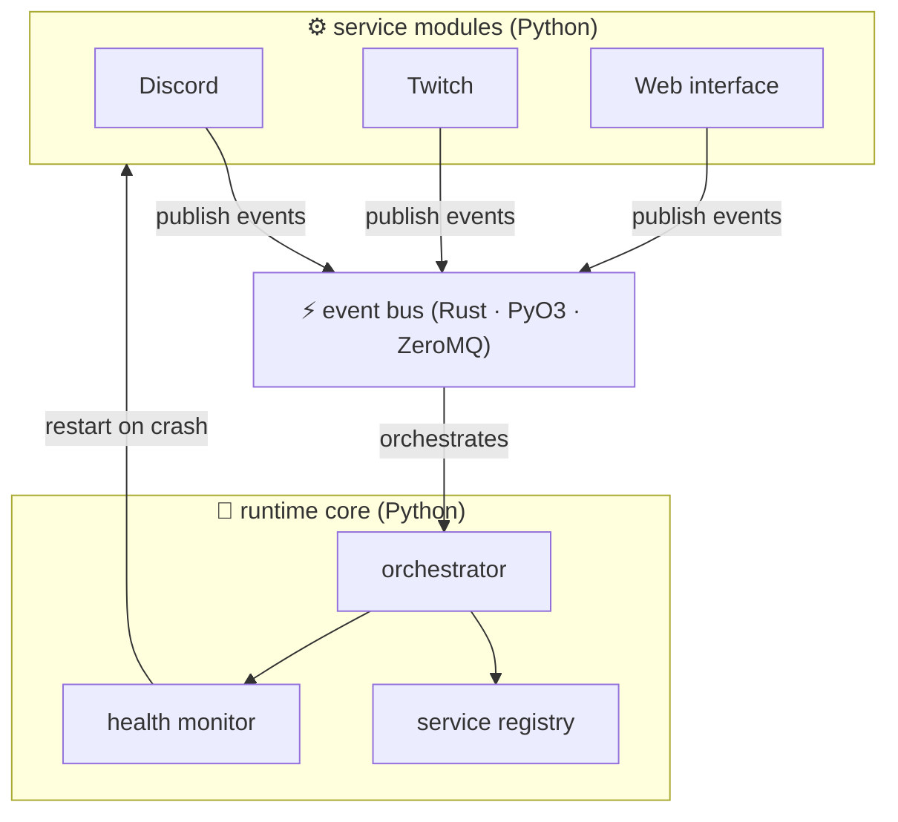

<div align="center">
  

  [](https://github.com/Elchi-Dev/nexus/actions/workflows/ci.yml)
  [](LICENSE)
  [](https://python.org)
  [](https://rustlang.org)
  [](https://github.com/Elchi-Dev/nexus)
  [](https://github.com/Elchi-Dev/nexus)
  [](utils/nexus_utils/line_break.py)
</div>

---

> [!WARNING]
> nexus is overengineered by design. our `line_break()` function is 300 lines long.
> our event bus is written in Rust. our Discord bot has a lifecycle management system
> with exponential backoff and a config singleton. **this is a feature, not a bug.**

> [!NOTE]
> if you were looking for `print("\n")`, you're in the wrong place.
> you are, however, in exactly the right place for unnecessary abstractions and memes.

---

## what is nexus?

nexus is a **polyglot service orchestration runtime** that connects Discord, Twitch,
and whatever else you throw at it — all communicating through a Rust-powered event bus
via ZeroMQ sockets.

think of it as the kubernetes of your basement server rack:
equally powerful, equally unnecessary, significantly more memes.

<details>
<summary>🧵 the origin story (a tragedy in one act)</summary>

&nbsp;

it started with a utility function to print newlines.

the function had a bug — it printed one too many newlines. a simple fix. two lines of code.

instead, someone wrote:

- a `BreakStyle` enum with 5 variants
- a `LineBreakConfig` global singleton
- three emitter strategies (`BurstEmitter`, `SequentialEmitter`, `ThrottledEmitter`)
- a `LineBreakObserver` protocol for hooking into every newline event
- a `@validate_break_args` decorator
- a `break_section()` context manager
- a `LineBreakEvent` frozen dataclass with `total_bytes` property
- overflow protection with configurable `OverflowPolicy`
- `overload` signatures
- 300 lines of typed, documented, tested Python

**nexus is that energy. but for an entire multi-service runtime.**

</details>

---

## architecture



> [!TIP]
> GitHub renders the above diagram natively. no screenshots. no plugins.
> just ` ```mermaid ` in a markdown file. one of GitHub's best-kept secrets.

---

## features

- **polyglot core** — Python orchestrator, Rust event bus, React/Svelte web UI, zero compromise
- **event-driven everything** — every service communicates through a typed, high-throughput pub/sub event bus
- **exponential backoff supervisor** — services restart automatically on crash, then gracefully give up[^1]
- **hot-reloadable modules** — add or remove integrations without restarting the runtime
- **unified config** — one `nexus.toml` to rule them all, with Pydantic validation and env var interpolation
- **web dashboard** — admin panel for ops + user-facing interface for everyone else
- **overengineered utils** — a `line_break()` function with three emission strategies and an observer pattern[^2]

---

## getting started

### prerequisites

| requirement | version | why |
|---|---|---|
| [Python](https://python.org) | 3.12+ | `match`, `Self`, every new typing feature |
| [Rust](https://rustlang.org) | stable | the event bus. yes, really. |
| [uv](https://docs.astral.sh/uv/) | latest | Python package management |
| [bun](https://bun.sh) | latest | frontend tooling |
| a sense of humour | any | **required. non-negotiable.** |

### installation

```bash
git clone https://github.com/Elchi-Dev/nexus
cd nexus
make setup   # installs Python deps, builds Rust, installs frontend
```

<details>
<summary>what <code>make setup</code> actually does</summary>

```bash
uv sync                          # install Python workspace packages
cargo build -p nexus-core-rs     # compile the Rust event bus via PyO3
cd web/frontend && bun install   # install the React/Svelte frontend
```

it's three commands. we put them in a Makefile because that's who we are.

</details>

### running nexus

```bash
cp .env.example .env   # add your tokens
make dev               # start everything
```

---

## modules

| module | status | what it does |
|---|---|---|
| `nexus-discord` | 🚧 wip | Discord bot with command routing and event bridge |
| `nexus-twitch` | 🚧 wip | Twitch chat, channel points, and EventSub |
| `nexus-web` | 🚧 wip | FastAPI backend + admin dashboard + user-facing UI |

> [!IMPORTANT]
> all modules are in early development. the architecture is solid.
> the implementations are... enthusiastic stubs. PRs welcome.

---

## project structure

```
nexus/
├── core/             # Python orchestrator runtime
├── core-rs/          # Rust event bus (PyO3 bridge)
├── modules/
│   ├── discord/      # Discord integration
│   └── twitch/       # Twitch integration
├── web/
│   ├── backend/      # FastAPI REST + WebSocket API
│   └── frontend/     # React / Svelte UI
├── utils/            # shared utilities (home of line_break)
├── config/           # TOML schema + Pydantic loaders
└── docs/             # you are here (probably lost)
```

---

## contributing

read [`CONTRIBUTING.md`](CONTRIBUTING.md) first. it's short, funny, and contains actual useful information.

PRs are genuinely welcome. the bar is:
- <kbd>make test</kbd> is green
- <kbd>make lint</kbd> is green
- you haven't simplified `line_break()` without a very good reason

> [!IMPORTANT]
> if you fix a bug, you are **strongly encouraged** to introduce a new design pattern
> somewhere else to compensate. we have a reputation to maintain.

### hall of the criminally overengineered

<a href="https://github.com/Elchi-Dev/nexus/graphs/contributors">
  
</a>

---

## license

[MIT](LICENSE) — do whatever you want. just don't replace `line_break()` with `print("\n")`.

---

[^1]: configurable via `OverflowPolicy` in `LineBreakConfig`. or in `nexus.toml`. we have both, because of course we do.
[^2]: `BurstEmitter` writes everything in one call. `SequentialEmitter` writes one break at a time for per-break observer hooks. `ThrottledEmitter` adds a configurable delay between breaks — completely pointless in production. it exists anyway.
